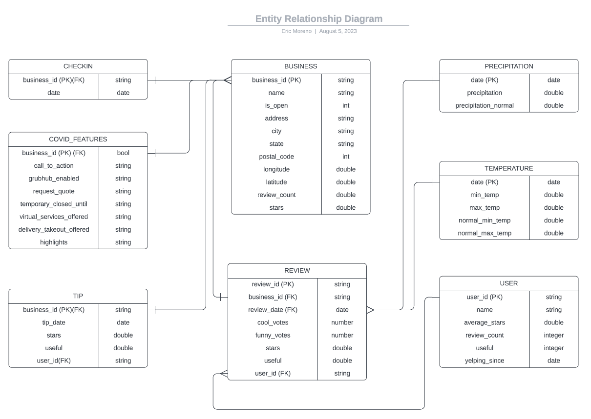

# Yelp & Weather ELT Pipeline Using Snowflake
End-to-end ELT data pipeline that ingests Yelp and weather data, stages it in Snowflake, and prepares it for analytics

## Overview
This portfolio project demonstrates an end-to-end ELT data pipeline designed to integrate and analyze Yelp and weather datasets. It simulates a real-world cloud-based architecture using AWS S3, Snowflake, and Power BI, following industry-standard data modeling practices across staging, operational, and analytics layers.  In this project I use Yelp and climate datasets for Las Vegas, Nevada to build a data warehouse that enables analysis of how weather impacts local business reviews.

## Architecture


## Tools & Technologies
- **Snowflake** – Cloud data warehouse for data modeling and analytics
- **AWS S3** – External stage for raw JSON data ingestion
- **SnowSQL CLI** – For uploading local files to internal Snowflake stages
- **SQL** – Used for all data loading and transformation logic


## ELT Workflow
This project implements a modern ELT (Extract, Load, Transform) approach that feeds directly into the dimensional star schema used in the Data Warehouse layer.
1. Extract:
    - Yelp data (.json.gz) and weather data (.csv) sourced from local machine.

2. Load:
    - Yelp data is uploaded to AWS S3 and ingested into Snowflake via an external stage using a JSON file format.
    - Weather data is loaded directly into Snowflake through an internal stage using the SnowSQL CLI.

4. Transform:
    - Raw data is first loaded into the Staging Layer, where basic structure and format validation occur.
    - Data is then processed into the Operational Data Store (ODS) — a clean, business-friendly representation of the data.
    - Finally, core business logic and aggregations are applied to produce analytics-ready fact and dimension tables in the Data Warehouse (DWH), modeled using a Star Schema (see below).

4. Visualize:
    - Power BI connects to the DWH layer to visualize business insights (e.g., impact of weather/COVID on Yelp businesses).

## Project Structure
The project is organized into defined layers to reflect the ELT pipeline:
```bash
sql/
├── 1_setup/
│   └── create_database_and_schemas.sql
├── 2_staging/
│   ├── create_staging_tables.sql
│   ├── load_yelp_json_from_external_stage.sql
│   ├── load_weather_csv_from_internal_stage.sql
├── 3_ods/
│   ├── create_ods_tables.sql
│   └── load_ods_tables.sql
├── 4_dwh/
│   ├── create_dwh_tables.sql
│   └── load_dwh_tables.sql
├── 5_analysis/
│   └── yelp_weather_analysis.sql
```

## Data Modeling & Schema Design
This project follows a dimensional modeling approach using a Star Schema in the Data Warehouse (DWH) layer.
- **Staging Layer:** Raw Yelp and weather data ingested into staging tables
- **ODS Layer:** Cleaned and structured intermediary tables for processing
- **DWH Layer:** Analytics-ready dimensional tables modeled using a star schema


### Entity Relationship Diagram (ERD)


### Star Schema


## Data Sources
This project uses publicly available datasets:
- Yelp Open Dataset
    - Download from: [https://business.yelp.com/data/resources/open-dataset/](https://business.yelp.com/data/resources/open-dataset/)
     - Includes business metadata and user reviews related to local businesses.

- Climate Resilience Toolkit – Climate Explorer
    - Download from: [https://crt-climate-explorer.nemac.org/](https://crt-climate-explorer.nemac.org/)
    - Contains historical and projected climate variables (e.g., temperature, precipitation).

## Prerequisites
- Snowflake account - requires role, database, warehouse, and schema permissions
- SnowSQL CLI - used to upload local files to internal Snowflake stage
- AWS S3 bucket- used to load files to external Snowflake stage

### SnowSQL CLI Configuration
Create a [SnowSQL](https://docs.snowflake.com/en/user-guide/snowsql) connection profile:
```bash
# ~/.snowsql/config

[connections.my_project]
accountname = <your_account>.snowflakecomputing.com
username = <your_username>
password = <your_password>
dbname = <your_database>
schemaname = <your_schema>
warehousename = <your_warehouse>
rolename = <your_role>
```
Connect using:
```bash
snowsql -c my_project
```


## How to Run
### Step 1: Download and Upload Yelp Data to AWS S3
1. Download the Yelp dataset
2. Dataset will contain JSON files for business, checkin, covid_features, reviews, tips, and users
3. Upload to your S3 bucket:

```bash
aws s3 cp ./data/yelp/ s3://your-bucket-name/yelp/ --recursive
```
The S3 bucket serves as the external stage for Snowflake to ingest Yelp data via JSON format.

### Step 2: Create External Stage in Snowflake (for Yelp JSON files)
In Snowflake, run the following SQL to set up a JSON file format and the external stage:
```bash
-- Step 1: Create a JSON file format
CREATE OR REPLACE FILE FORMAT YELP.STAGING.json_fileformat
    TYPE = 'JSON'
    COMPRESSION = 'AUTO'
    STRIP_OUTER_ARRAY = TRUE;

-- Step 2: Create external stage linked to S3 bucket
CREATE OR REPLACE STAGE external_json_stage
    URL = 's3://bucket-name'
    STORAGE_INTEGRATION = s3_int
    FILE_FORMAT = json_fileformat;
```
Note: s3_int refers to a Snowflake storage integration that must be preconfigured to securely access your S3 bucket.

### Step 3: Create Internal Stage for Weather CSV Files
```bash
CREATE OR REPLACE STAGE my_csv_stage;
```
This internal stage stores local weather CSV files uploaded via the SnowSQL CLI.

### Step 4: Upload & Load Weather Data Using SnowSQL
1. Upload files to the internal stage
```bash
put file:///path/to/usw00023169-las-vegas-mccarran-intl-ap-precipitation-inch.csv @my_csv_stage auto_compress=true;

put file:///path/to/usw00023169-temperature-degreef.csv @my_csv_stage auto_compress=true;
```

2. Create a CSV file format
```bash
CREATE OR REPLACE FILE FORMAT csv_fileformat
    TYPE = 'CSV'
    FIELD_OPTIONALLY_ENCLOSED_BY = '"'
    SKIP_HEADER = 1;
```

```bash
COPY INTO precipitation
FROM @my_csv_stage/usw00023169-las-vegas-mccarran-intl-ap-precipitation-inch.csv.gz
FILE_FORMAT = csv_fileformat
ON_ERROR = 'CONTINUE'
PURGE = TRUE;

COPY INTO temperature
FROM @my_csv_stage/usw00023169-temperature-degreef.csv.gz
FILE_FORMAT = csv_fileformat
ON_ERROR = 'CONTINUE'
PURGE = TRUE;
```

### Step 5: Run SQL Scripts to Setup and Build the Data Warehouse
Execute the SQL scripts in the following order:
1. `sql/Database_Setup.sql`
2. `sql/Load_JSON_Data_From_S3.sql`
3. `sql/Load_CSV_Files_Using_SnowSQL.sql`
4. `sql/Staging_to_ODS`
5. `sql/ODS_to_DWH.sql`
6. `sql/Yelp_weather_analysis.sql`

## Author
**Eric Moreno**
